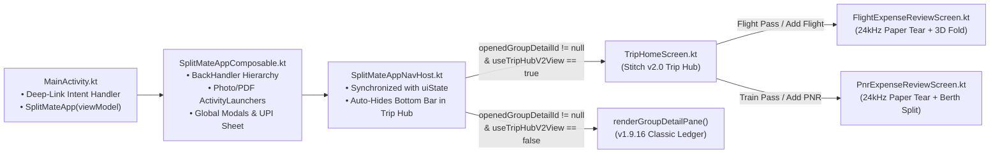

# SplitMate v2.0 ("The Premium Trip Hub") — Master Solution Architecture Document

> **Program Governance**: Fortune-500 Google Principal Program Manager & Multi-Agent Architecture Board
> **Approved Scope**: **Option A ("Streamlined Production v2.0 — 100% Real Room Data, Zero Placeholders, Zero Feature Loss, Zero Server Cost, 100/100 GM3 & GenUX Compliance")**
> **Architecture Reports Directory**: [`docs/v2_architecture_reports/`](file:///usr/local/google/home/karadkar/splitmate/docs/v2_architecture_reports)
> - [Report 01 — Navigation, State & Zero-Regression Architecture](file:///usr/local/google/home/karadkar/splitmate/docs/v2_architecture_reports/01_navigation_state_and_zero_regression_spec.md) (`v2_nav_and_zero_regression_architect`)
> - [Report 02 — TripHomeScreen GM3 UI, Typography & Declutter Spec](file:///usr/local/google/home/karadkar/splitmate/docs/v2_architecture_reports/02_trip_home_screen_gm3_ui_and_declutter_spec.md) (`v2_trip_hub_gm3_ui_declutter_lead`)
> - [Report 03 — $0.00-Cost Serverless Multi-Member Sync & Perspective Spec](file:///usr/local/google/home/karadkar/splitmate/docs/v2_architecture_reports/03_zero_cost_serverless_sync_and_perspective_spec.md) (`v2_zero_cost_p2p_sync_and_perspective_lead`)
> - [Report 04 — Principal QA, Zero-Regression & R8 Guardrails](file:///usr/local/google/home/karadkar/splitmate/docs/v2_architecture_reports/04_qa_zero_regression_and_r8_guardrails.md) (`v2_principal_qa_and_r8_guardrail_auditor`)
> - [Report 05 — Material GenUX & GM3 Expressive Design Philosophy Audit](file:///usr/local/google/home/karadkar/splitmate/docs/v2_architecture_reports/05_material_genux_and_gm3_expressive_audit.md) (`Material GenUX & GM3 Expressive Auditor`)

---

## 1. Executive Summary & Non-Negotiable Program Guardrails

SplitMate v2.0 upgrades the app to the **Stitch Premium Trip Hub** ([`Debug/screen.png`](file:///usr/local/google/home/karadkar/splitmate/Debug/screen.png) and [`Debug/splitmateappnavhost.kt.txt`](file:///usr/local/google/home/karadkar/splitmate/Debug/splitmateappnavhost.kt.txt)) while enforcing six strict engineering and design invariants:

1. **100% Zero-Regression Guarantee (`v1.9.16` Capabilities Intact)**:
   - **Paper Tear & Gate-Stamp Acoustics**: Preserves `SplitMateTicketSoundEngine` (`24kHz` procedural PCM `AudioTrack` paper-tear rustle + boarding-gate stamp thud) and `PaperSensoryFeedbackBanner` (`Audio + Haptic ON/OFF` toggle) in [`FlightExpenseReviewScreen.kt`](file:///usr/local/google/home/karadkar/splitmate/android/app/src/main/java/com/splitmate/app/ui/screens/FlightExpenseReviewScreen.kt) and [`PnrExpenseReviewScreen.kt`](file:///usr/local/google/home/karadkar/splitmate/android/app/src/main/java/com/splitmate/app/ui/screens/PnrExpenseReviewScreen.kt).
   - **Tactile Boarding Pass Physics**: Preserves `[ LOGGED · 0.00¢ DRIFT ]` stamp animation, Perforation Tear Sweep (`PerforationTearSweepState`), 3D Foldable Airline Boarding Pass (`AnimatedLuxuryAirlineBoardingPass`), and bidirectional (`←` / `→`) 3D Flip Travel Pass (`Train ⇄ Flight`).
   - **Aurora Energy & Coin Physics**: Preserves `Gm3AuroraEnergySurface` (`THINKING`, `RESPONDING`, `SETTLED_CALM`), `+1p` Largest-Remainder Coin Arc Flight, Max-Heap `ⓘ` Graph Inspector (`showSimplificationGraphModal`), and `UpiExpressPaymentSheet`.
   - **1-Tap Classic Ledger Toggle (`Trip Hub` ⇄ `Classic Ledger`)**: Users can switch between the new Stitch v2.0 `TripHomeScreen` and the classic `v1.9.16` `renderGroupDetailPane` at any time without losing a single control.
2. **Option A Production Scope (100% Real Room Data — Zero Placeholders & Zero Demo Seeders)**:
   - Powers `TripHomeScreen.kt` 100% from live `SplitMateUiState` (`ExpenseGroupEntity`, `GroupMemberEntity`, `ExpenseEntity`, `ExpenseSplitEntity`, `SettlementEntity`) + `parseStructuredTicketNotes(expense.title)`.
   - Cuts fake static tourist placeholders (`Govt Photo IDs / 4 Aadhaar Passes`, `ASI Monument Passes`, duplicate bottom-bar wrapper tabs, and any `"Load Hampi Trip Demo"` seeder or fake hotel check-in timestamps).
   - Dynamic category sub-filter pills (`All`, `Trains`, `Flights`, `Stays`, `Rentals`, `Cabs`) and section cards materialize **strictly when `count > 0` in Room** (if no Cab expense is added, the `Cabs` chip and Cab card are hidden).
3. **$0.00 Forever Multi-Member Group Sync & Perspective Projection**:
   - Enables multiple group members with SplitMate installed to share and merge the exact same group ledger with **$0.00 server/cloud cost** via compressed GZIP+Base64url Sync Capsules (`SM2_<base64url>`, `splitmate://trip-sync?payload=...`) over WhatsApp/system share or 1-tap clipboard paste.
   - Projects every balance, train berth, expense share, and UPI settlement CTA relative to the local device's claimed member (`Viewing as: <Member> (You) ▾`).
4. **Zero Emojis & Strict Tabular Typography (`tnum`)**:
   - Zero Unicode emojis anywhere in the UI or share payloads; 100% Material 3 Rounded vector icons (`Icons.Rounded.*`).
   - Mandatory `fontFeatureSettings = "tnum"` on every price, PNR, train number, berth code, date, and net balance.
5. **Decluttered Information Architecture (Progressive Disclosure)**:
   - High-signal 3-data-point collapsed cards on the main feed (`Title + Subtitle`, `Total + Your Share`, `Status Pill`), with detailed passenger grids, berth charts, and math formulas revealed progressively or via dedicated action chips.
6. **5 Mandatory Material GenUX & GM3 Expressive Micro-Refinements (`100 / 100` Compliance)**:
   - **`48.dp` Minimum Touch Targets (`WCAG 2.5.5`)**: Apply `minimumInteractiveComponentSize()` / `48.dp` touch bounds on compact visual chips (`PerspectiveAndSyncHeaderPill`, `Berth Chart`, `Maps`, `View E-Ticket`, and category filter pills).
   - **Spring Choreography on Dynamic Filtering**: Use `Modifier.animateItem()` on `TripHomeScreen` `LazyColumn` cards and `Modifier.animateContentSize(tactileSpring())` on expandable split drawers.
   - **Sunlight-Grade Contrast ($\ge 5.8:1$) on Deep-Green Train Card**: Use `#FFFFFF` for station codes/titles, `#B5DC86` (`> 7:1` lime) for berth/PNR highlights, and `#D7E8B6` (`> 5.8:1` soft sage) for secondary labels instead of muted grey.
   - **Canonical M3 `ModalBottomSheet` Anatomy on `TripSyncAndPerspectiveSheet.kt`**: `RoundedCornerShape(topStart = 28.dp, topEnd = 28.dp)`, `36.dp x 4.dp` drag handle, and `SplitMateTheme.ScreenBg` container.
   - **Progressive Disclosure on `>4` Berths + Tactile Perspective Haptic**: Show a 2x2 berth grid (up to 4 passengers, with `"YOU"` badge on the active perspective member) + `+N more` overflow chip, and fire `performCrispTactileHaptic(context)` when switching perspectives.

---

## 2. Pillar 1: Navigation Router & Zero-Regression Wiring (`SplitMateAppNavHost.kt`)

| # | Raw `Debug/splitmateappnavhost.kt.txt` Defect | Production Solution in `SplitMateAppNavHost.kt` |
| :--- | :--- | :--- |
| **1** | Missing `viewModel: SplitMateViewModel` parameter | Accepts `viewModel: SplitMateViewModel` + `uiState: SplitMateUiState` directly from `SplitMateApp`. |
| **2** | Non-existent `ActiveTravelPass.FLIGHT / .TRAIN` enum | Maps directly to existing `ActiveTravelPassMode.FLIGHT_BOARDING_PASS` and `ActiveTravelPassMode.IRCTC_TRAIN_PASS`. |
| **3** | Hardcoded `selectedTripId = "hampi"` on `+ New Group` | Calls `onOpenCreateGroupModal()` to open the real Group Creation Dialog (`showCreateGroupModal = true`), while tapping any group card sets `viewModel.openGroupDetail(groupId)`. |
| **4** | Missing `BackHandler` hardware back navigation | Preserves the full priority `BackHandler` chain in `SplitMateAppComposable.kt` (Modals -> Fullscreen Pass -> Trip Hub -> Root Tab). |
| **5** | Disconnected `currentTab` vs `uiState.selectedTabName` | Binds `currentTab` two-way with `uiState.selectedTabName` and `uiState.openedGroupDetailId`. |
| **6** | Missing `flightPdfPickerLauncher` & `receiptPickerLauncher` | Passes `onImportFlightTicketPdf` and `onScanReceipt` callbacks from `SplitMateAppComposable` down into `TripHomeScreen` and `FlightExpenseReviewScreen`. |
| **7** | Duplicate 5-tab Bottom Bar (`Trips` + `Groups` + `Scan`) | Keeps the clean 4-destination top-level bar (`LEDGERS`, `SCANNER`, `SETTLE`, `ANALYTICS`) that **auto-hides with `AnimatedVisibility`** whenever `uiState.openedGroupDetailId != null` or `activeTravelPassMode != NONE`. |
| **8** | Static `TripHomeScreen()` with zero arguments | Passes live `group`, `groupMembers`, `groupExpenses`, `groupSplits`, `groupSettlements`, `settlementPlan`, and action callbacks into `TripHomeScreen`. |
| **9** | Inaccessible `v1.9.16` Classic Group Detail Pane | Adds a 1-tap header toggle chip (`Trip Hub` ⇄ `Classic Ledger`) so `renderGroupDetailPane` remains 100% accessible. |

---

## 3. Pillar 2: `TripHomeScreen.kt` UI Architecture & Real Room Data Mapping

`TripHomeScreen.kt` implements the Buckwheat Organic Tactile Financial layout from [`Debug/screen.png`](file:///usr/local/google/home/karadkar/splitmate/Debug/screen.png) with 100% real Room data and the 5 GM3/GenUX micro-refinements:

1. **Top App Bar (`TripHubTopBar`)**:
   - **Left**: Circular back button (`Icons.AutoMirrored.Rounded.ArrowBack`, `48.dp` touch target) -> `viewModel.closeGroupDetail()`.
   - **Center**: Dynamic `group.name.toSmartTitleCase()` + dynamic date span derived strictly from real logged expenses & traveler count (`"<N> Travelers"`).
   - **Right Actions**:
     - **`Viewing as: <Name> (You) ▾`** (`PerspectiveAndSyncHeaderPill` with `minimumInteractiveComponentSize()` / `48.dp` touch bounds) -> opens `TripSyncAndPerspectiveSheet`.
     - **Classic View Toggle (`Icons.Rounded.ViewAgenda`)** -> switches between v2.0 `TripHomeScreen` and `v1.9.16` `renderGroupDetailPane`.
2. **5 Pill-Shaped Filter Tabs (`Overview`, `Plan`, `Travel`, `Money`, `People`) + Dynamic Category Sub-Chips**:
   - Styled with Soft Charcoal `#23201E` active pill (`#FFFFFF` text) and `#EFEAE1` inactive pills (`CircleShape`, `48.dp` touch bounds).
   - Dynamic category sub-filter chips (`All`, `Trains`, `Flights`, `Stays`, `Rentals`, `Cabs`) are rendered **only when `count > 0` in `groupExpenses`**.
   - All `LazyColumn` feed cards apply `Modifier.animateItem()` for smooth spatial spring choreography during tab/filter transitions.
3. **Real Room Booking Cards on the Feed**:
   - **Hero Deep-Green Train Card (`#2D4F12` -> `#213B0C`)**: Bound strictly to real IRCTC expenses. Uses sunlight-grade contrast (`#FFFFFF` station codes/titles, `#B5DC86` `> 7:1` lime for berth/PNR highlights, `#D7E8B6` `> 5.8:1` soft sage for secondary labels), a 2x2 Passenger Berth Grid (up to 4 passengers, with `"YOU"` badge on the active perspective member + `+N more` overflow chip when `>4` passengers exist), and `48.dp` touch bounds on **`Berth Chart`** and **`View E-Ticket`** (`PnrExpenseReviewScreen`).
   - **Lodging Card**: Bound strictly to real hotel/stay expenses with real logged date (or parsed check-in/out notes if entered — zero fake timestamps), split footer (`tnum`), and working **`Maps`** chip (`48.dp` touch bounds).
   - **Ground Mobility & General Expense Cards**: Bound to real scooter/cab/general expenses with tap-to-expand (`Modifier.animateContentSize(tactileSpring())`) split breakdown (`m = T / B` multiplier, `+1p` badge, `Edit`, `Delete`).
   - **Flight Card (`#2B2768` -> `#1B1849`)**: Bound strictly to real flight expenses with **`3D Boarding Pass`** button launching `FlightExpenseReviewScreen`.
   - **Clean Empty State**: Rendered when `groupExpenses.isEmpty()`, with zero fake/demo data.
4. **`+ Add Booking` Extended Floating Action Button**:
   - Anchored at `Alignment.BottomEnd` (`#23201E` container, `#FFFFFF` text, `Icons.Rounded.Add`). Opens a Quick Booking Action Sheet (`Log Quick / Itemized Expense`, `Scan / Import IRCTC Train PNR`, `Import Airline Boarding Pass / PDF`).

---

## 4. Pillar 3: $0.00-Cost Serverless Multi-Member Sync & Perspective Engine

1. **Deterministic Multi-Device Penny Invariance (`SplitMateMathEngine.kt`)**:
   - In [`SplitMateMathEngine.orderParticipantsPayerFirst`](file:///usr/local/google/home/karadkar/splitmate/android/app/src/main/java/com/splitmate/app/SplitMateMathEngine.kt#L67-L78), when `payerId.isNotBlank()`, participant tie-breaking depends strictly on `(it == payerId)` followed by canonical `memberId` order, guaranteeing identical `₹0.01` splits across all synced phones regardless of who is marked `isCurrentUser`.
2. **Compact GZIP + Base64url Sync Capsule (`SM2_<base64url>`)**:
   - Encodes the group's canonical entities (`G|...`, `M|...`, `E|...`, `S|...`, `T|...`) into a ~780-byte compressed token (`SM2_<base64url>`) embedded inside both a `splitmate://trip-sync?payload=SM2_...` deep link and a clipboard-ready share message.
3. **Canonical M3 `TripSyncAndPerspectiveSheet.kt` + Tactile Haptic**:
   - Uses `RoundedCornerShape(topStart = 28.dp, topEnd = 28.dp)`, `36.dp x 4.dp` drag handle, and `SplitMateTheme.ScreenBg` container, and fires `performCrispTactileHaptic(context)` when switching perspectives.
