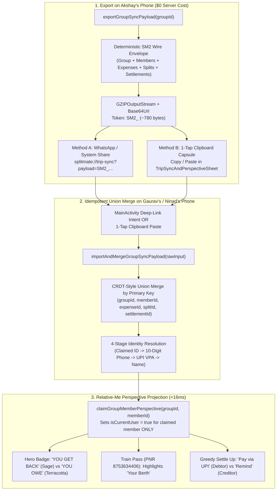

# Report 03: $0.00-Cost Serverless Multi-Member Sync & Perspective-Relative Engine Specification

> **Subagent Owner**: `v2_zero_cost_p2p_sync_and_perspective_lead` (`gthink` + `google_principal_group_sync_and_perspective_lead`)
> **Target Cost**: **$0.00 Forever** (100% Serverless, Zero Firebase/Cloud Fees, Zero Room Schema Migrations, Zero External Paid Dependencies)

---

## 1. End-to-End $0.00 Serverless Sync & Perspective Architecture

### 1.1 Canonical Ledger Invariant vs. Device-Local Perspective Bit
In [`RoomEntities.kt`](file:///usr/local/google/home/karadkar/splitmate/android/app/src/main/java/com/splitmate/app/data/RoomEntities.kt#L24-L184) and [`SplitMateViewModel.kt`](file:///usr/local/google/home/karadkar/splitmate/android/app/src/main/java/com/splitmate/app/ui/SplitMateViewModel.kt#L145-L259), every financial entity uses globally immutable string IDs (`groupId`, `memberId`, `expenseId`, `splitId`, `settlementId`), while every perspective-relative UI stream (`totalBalance`, `activeGroups`, `settlementPlan`, `resolveExpenseSplitBreakdown`) pivots on a single boolean column:
```kotlin
val meMember = groupMembers.find { it.isCurrentUser } ?: groupMembers.firstOrNull()
```



### 1.2 Method A: 1-Tap WhatsApp / System Share Deep-Link + Text Capsule
1. **Compact Wire Format (`SM2_<base64url>`)**:
   - Serializes the canonical group graph (`ExpenseGroupEntity`, `List<GroupMemberEntity>`, `List<ExpenseEntity>`, `List<ExpenseSplitEntity>`, `List<SettlementEntity>`) using a pure-Kotlin URL-escaped record format compressed with `GZIPOutputStream` and encoded with URL-safe `java.util.Base64.getUrlEncoder().withoutPadding()`.
   - Requires **zero external library dependencies** and executes identically in Android runtime and pure-JVM JUnit 5 tests (`./gradlew testDebugUnitTest`).
2. **Dual-Action Share Message**:
   - Generates both a clickable `splitmate://trip-sync?payload=SM2_...` deep link (handled natively via [`AndroidManifest.xml`](file:///usr/local/google/home/karadkar/splitmate/android/app/src/main/AndroidManifest.xml) `<intent-filter>`) **and** an embedded `SM2_...` text token so friends on apps that strip custom-scheme links can simply copy the whole WhatsApp message and tap **"Paste & Merge from Clipboard"** inside SplitMate.

### 1.3 Method B: Zero-Dependency In-App Sync & Perspective Sheet (`TripSyncAndPerspectiveSheet.kt`)
Accessible from the Trip Hub (`TripHomeScreen` / `renderGroupDetailPane` in [`SplitMateAppComposable.kt`](file:///usr/local/google/home/karadkar/splitmate/android/app/src/main/java/com/splitmate/app/ui/SplitMateAppComposable.kt#L967-L1236)) via the **`Viewing as: <Member> (You) ▾`** header pill or **`Sync`** button:
1. **1-Tap Perspective Switcher (`"Who are you in this trip?"`)**:
   - Displays horizontal/flow chips for every group member (`[ Akshay (You) · +₹4,984.06 ]`, `[ Gaurav · +₹1,258.66 ]`, `[ Gaurii · -₹701.39 ]`, `[ Ninad · -₹5,541.33 ]`).
   - Tapping any member chip calls `viewModel.claimGroupMemberPerspective(groupId, member.memberId)`, immediately re-projecting all net balances, train berths, expense cards, and UPI settlement CTAs from that member's perspective in `<16ms`.
2. **1-Tap WhatsApp & System Share**:
   - Launches `Intent.ACTION_SEND` targeted at `com.whatsapp`, gracefully falling back to the system share chooser if WhatsApp is not installed.
3. **1-Tap Clipboard Auto-Detect & Merge**:
   - Automatically inspects `ClipboardManager.primaryClip` when the sheet opens. If a `splitmate://trip-sync` URI or `SM2_` capsule is detected on the clipboard, a highlighted Sage banner lets the user merge with a single tap (plus a manual paste text field fallback).

---

## 2. Perspective Projection Matrix Across All 4 Hampi Travelers

| Traveler | Canonical Net Balance (`paise`) | Perspective Hero Pill (`isCurrentUser = true`) | Train Ticket Card (`PNR 8753634406`) | Greedy Settle Up Action |
| :--- | :--- | :--- | :--- | :--- |
| **Akshay** | `+498406L` (`+₹4,984.06`) | `YOU GET BACK ₹4,984.06` (Sage `#D7E8B6`) | Highlights **Akshay · CNF / B2 / 17 (LB) (You)** · `"Paid by You"` | Shows **Remind Ninad** (`₹4,984.06`) + **Mark Paid** |
| **Gaurav** | `+125866L` (`+₹1,258.66`) | `YOU GET BACK ₹1,258.66` (Sage `#D7E8B6`) | Highlights **Gaurav · CNF / B2 / 18 (MB) (You)** · `"Paid by Akshay"` | Shows **Remind Gaurii** (`₹701.39`) & **Remind Ninad** (`₹557.27`) |
| **Gaurii** | `-70139L` (`-₹701.39`) | `YOU OWE ₹701.39` (Terracotta `#FED8C8`) | Highlights **Gaurii · CNF / B2 / 19 (UB) (You)** · `"Your share ₹1,086.25"` | Shows **1-Tap Pay ₹701.39 via UPI to Gaurav** (`UpiExpressPaymentSheet`) |
| **Ninad** | `-554133L` (`-₹5,541.33`) | `YOU OWE ₹5,541.33` (Terracotta `#FED8C8`) | Highlights **Ninad · CNF / B2 / 20 (SL) (You)** · `"Your share ₹1,086.25"` | Shows **1-Tap Pay ₹4,984.06 to Akshay** & **Pay ₹557.27 to Gaurav** |

---

## 3. Target Files & Implementation Contract

1. **`SplitMateMathEngine.kt` (`orderParticipantsPayerFirst`)**:
   - Remove `.thenByDescending { it == currentUserId }` when `payerId` is non-blank so that `+1p` Largest-Remainder penny allocation is 100% deterministic across all group members' phones regardless of who is marked `isCurrentUser`.
2. **`SplitMateViewModel.kt`**:
   - Add `GroupSyncExportBundle` and `GroupSyncMergeResult` models.
   - Add `claimGroupMemberPerspective(groupId: String, memberId: String)`.
   - Add `computeGroupMemberNetBalances(groupId: String): Map<String, Long>`.
   - Add `exportGroupSyncPayload(groupId: String): GroupSyncExportBundle?`.
   - Add `importAndMergeGroupSyncPayload(rawPayloadOrMessage: String, claimedMemberIdOverride: String?, openGroupAfterMerge: Boolean): GroupSyncMergeResult`.
   - Add `resolveLocalPerspectiveMemberId(...)` (4-stage identity resolution: explicit/prior claim -> 10-digit phone -> UPI VPA -> local profile name).
   - Add `SplitMateViewModel.extractSyncTokenFromRawInput(rawInput: String): String?`.
3. **`AndroidManifest.xml` & `MainActivity.kt`**:
   - Register `<intent-filter>` for `splitmate://trip-sync` (`android:scheme="splitmate"`, `android:host="trip-sync"`, `android:launchMode="singleTop"`).
   - Handle `Intent.ACTION_VIEW` and `Intent.ACTION_SEND` in `MainActivity.onCreate` and `MainActivity.onNewIntent`.
4. **`TripSyncAndPerspectiveSheet.kt`**:
   - Create `PerspectiveAndSyncHeaderPill` (enforcing `minimumInteractiveComponentSize()` / `48.dp` WCAG 2.5.5 touch bounds) and `TripSyncAndPerspectiveSheet` composable modal with 1-tap perspective chips, 1-tap WhatsApp/System share, and 1-tap clipboard auto-detect/merge.
   - Apply Canonical M3 `ModalBottomSheet` anatomy: `shape = RoundedCornerShape(topStart = 28.dp, topEnd = 28.dp)`, `36.dp x 4.dp` drag handle (`BottomSheetDefaults.DragHandle(color = SplitMateTheme.BorderLight, width = 36.dp, height = 4.dp)`), and `containerColor = SplitMateTheme.ScreenBg`.
   - Fire `performCrispTactileHaptic(context)` whenever the user taps a member chip to switch perspective.
   - Strictly zero emojis (`Icons.Rounded.*` only) and `fontFeatureSettings = "tnum"` on all member balance badges.
